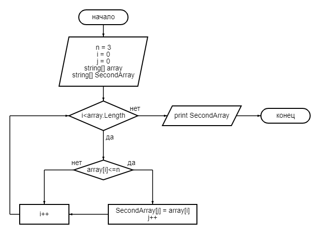

# Итоговая проверочная работа

## Задача
Написать программу, которая из имеющегося массива строк формирует новый массив из строк, длина которых меньше либо равна 3 символа. Первоначальный массив можно ввести с клавиатуры, либо задать на старте выполнения алгоритма. При решении не рекомендуется пользоваться коллекциями, лучше обойтись исключительно массивами.

## Блок-схема алгоритма

## Алгоритм решения
1. Пользователь вводит размер массива.
2. Пользователь вводит каждый элемент поочерёдно.
3. Определяем количество элементов, содержащих не более 3 символа. 
4. Если определено, что искомых элементов не введено, выводим сообщение: "Искомых элементов для нового массива не обнаружено".
5. В другом случае записываем эти элементы в новый массив.
6. Выводим первоначальный и новый массивы на печать.